  

# Hi there, I'm Austin 👋

I'm a Computer Science student at Strathmore University with a passion for building practical software solutions, exploring cybersecurity, and solving real-world problems through technology. I enjoy working across the full stack, learning how systems work under the hood, and continuously pushing myself through projects, hackathons, and leadership opportunities.

- 🔭 **Current Focus:** Full-stack web development, cybersecurity studies, and building scalable software applications.
- 🌱 **Learning & Exploration:** Computer networks, cybersecurity, cloud technologies, system design, and advanced software engineering principles.
- âš¡ **Core Interests:** Software Engineering, Cybersecurity, Full-Stack Development, Networking, AI Applications, and Digital Innovation.

---

## Technical Ecosystem

### Core Competencies & Core Stack

  
  
  
  
  
  
  
  

### Networking & Cybersecurity

  
  
  

### Tooling & Infrastructure

  
  
  
  
  

---

## Featured Projects

### 🏠 Property Management System
A scalable property management platform built with React, Tailwind CSS, Node.js, and MySQL featuring rent tracking, maintenance requests, and secure authentication.

### ❤️ Charity Web Application
A full-stack donation platform enabling charities to showcase projects, receive donations, and track impact.

### 🍳 Recipe Website
An interactive recipe-sharing platform integrating APIs, category filtering, and responsive design.

### 📅 Event Management System
A Java & MySQL desktop application for scheduling, registrations, and payment management.

---

## Leadership & Achievements

🏆 KAPPS Inter-University Hackathon Winner (2024)

🎓 Dean's List Scholar – Strathmore University

👨‍💼 President – Chinese Club

âš½ SCES Inter-Class Football Tournament Winner

👥 Experienced Project Leader, Module Leader, and Team Coordinator

---

## GitHub Stats

Self-hosted cards generated in this profile repository by [github-readme-stats-action](https://github.com/stats-organization/github-readme-stats-action) (from [github-stats-extended](https://github.com/stats-organization/github-stats-extended)), so they do **not** depend on the shared public stats instance.

  
  &nbsp;
  

### Bonus card (not from github-stats-extended)

Activity graph from [github-readme-activity-graph](https://github.com/Ashutosh00710/github-readme-activity-graph):

  

---

## Beyond Tech

- 🌍 Community Outreach Volunteer
- 🇨🇳 Learning Mandarin Chinese
- âš½ Football & Basketball Enthusiast
- 📚 Interested in Philosophy, Leadership, and Personal Growth
- ✝️ Passionate about faith, purpose, and lifelong learning

---

## Connect With Me

- 💼 LinkedIn: www.linkedin.com/in/austin-kimathi-01109a311
- 📧 Email: austinkimathi30@gmail.com

  

